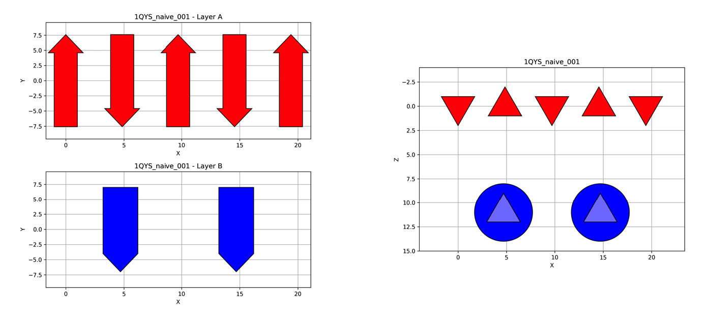

TopoBuilder
===========

*TopoBuilder* is a **Python2 only** library for the construction of tailored protein scaffolds around
functional structural motifs of interest.

Provided a PDB-formatted file from the **Protein Data Bank** (PDB_) with the functional motif of interest
and a **JSON** configuration file with the expected topology, *TopoBuilder* will generate all the necessary
files to execute the FunFolDes_ protocol of the Rosetta_ suite in a non-mpi, SLURM-managed cluster.

Installation
------------

*TopoBuilder* can be installed for **Python 2.7** from the git repository through pip:

.. code-block:: bash

  pip install https://github.com/lpdi-epfl/topobuilder/archive/v1.0.2.zip

Requirements
------------

To complete a full *TopoBuilder* pipeline you will need:

* The Rosetta_ design suite, at least **v3.8**.
* Python>=2.6<3.0

If unsure of whether your current Rosetta installation can run the inputs generated by *TopoBuilder*, type:

.. code-block:: bash

  /path/to/rosetta/bin/rosetta_scripts.<os><compiler><type> -info NubInitioMover

to see if it can run FunFolDes_.

How to Create a Topobuilder Input File
--------------------------------------

To see all the options to execute *TopoBuilder*, write:

.. code-block:: bash

  python -m topobuilder -h

*TopoBuilder* builds the topologies by initially placing secondary structures in a X-Z grid,
where Z represents depth and X represents width. The Y axis (which is high) can also be specified,
but it is not necessary. Initially, the protocol, given a position and number of secondary structures
(architecture), will try all possible connectivities (topologies) fitting that architecture as long as
the motif allows it (multi-segment motifs, by their nature, limit combinatorial possibilities).
The best way to explain how to work with *TopoBuilder* is through an example.
Let's say on wants to build a topology carrying the 4e10 epitope from HIV (2FX7_).

To simplify, we will try a **4-helix bundle**. For that, we would write a **JSON** input such as:

.. code-block:: json

  {
    "config": {
      "name": "4hb",
      "vall": "/work/upcorreia/bin/Rosetta/tools/fragment_tools/vall.jul19.2011.gz",
      "rbin": "/work/upcorreia/bin/Rosetta/weekly/source/bin/rosetta_scripts.linuxiccrelease"
    },
    "layers" : [
      [
        { "type" : "H",
          "length" : 16
        },
        { "type" : "H",
          "length" : 16
        }
      ],
      [
        { "type" : "H",
          "ref": "2fx7.helix"
        },
        { "type" : "H",
          "length" : 16
        }
      ]
    ],
    "motifs": [
      {
        "id": "2fx7",
        "pdbfile": "2fx7.pdb",
        "chain": "P",
        "segments": [
          {
            "ini": 671,
            "end": 686,
            "id": "helix"
          }
        ]
      }
    ]
  }

(files to execute this example can be found in the ``demo`` folder).

``config``, ``layers`` and ``motifs`` are the top, mandatory fields.

``config``
**********

The mandatory parameter here are:

* ``name``: identifies the full execution.
* ``vall``: path to the vall database to generate protein fragments.
  This refers to the path **in the cluster were you plan on running Rosetta**.
* ``rbin``: path to the rosetta_scripts executable.
  This refers to the path **in the cluster were you plan on running Rosetta**.

Other parameters that can be provided but have default values are:

* ``default_z``: Default depth between secondary structure layers. (default=11)
* ``default_x_h``: Default width between helices in the same layer. (default=11)
* ``default_x_e``: Default width between beta strands in the same layer. (default=5)
* ``link_dist``: Defalut distance between secondary structure to consider connecting them.
* ``connectivity``: If provided, create a given connectivity instead of trying all possible.
  Connectivity should be defined as a string in FORM_ format, in which each secondary structure
  is defined by ``<layer_id><layer_position><SSE_type>``; where ``<layer_id>`` is an uppercase letter
  starting in A, ``<layer_position>`` is an integer starting in 1 and ``<SSE_type>`` is either (H) helix
  or (E) beta. We will see how this looks like in the results from the example execution.
* ``l_linkers``: Define the lengths of the loops between secondary structures (plus N- and C- terminal) as a list of numerical values.
  If not provided, N- and C-terminal default to 1 residue and the loop lengths are calculated as ``int(SSE distance / GLY max span)``.
  The list will be of size ``count(SSE) + 1``. 

``layers``
**********

Layers are represented as a list of lists. The top level list represents Z-depth layers; and each inner list represents the
list of secondary structures (defined as dictionaries) on that layer. The number and type of structures, together with ``default_x_h``
or ``default_x_e`` will define the width of that layer. The secondary structures of a protein FORM_ expand on the Y axis (left image) and are represented within this X-Z plane as shown on the right image:

Each structure dictionary must contain the ``type`` (H or E) and the ``length`` (number of residues), with the exception of those structures pointing
to the segments of the motif, which substitute ``length`` by ``ref``, which will point to the ``<motif>.<segment>`` identifier (as we will see in the
last top field). Additional parameters are:

* ``shift_<dimension>``: Being ``dimension`` either ``x``, ``y`` or ``z``. Moves the secondary structure in the requested dimension. Applies over the
  expected shift applied by the system. Thus, ``shift_x=-2`` applied to the second helix of a layer, assuming ``default_x_h==11`` will actually shift
  the helix by 9.
* ``tilt_<dimension>``: Being ``dimension`` either ``x``, ``y`` or ``z``. Tilts the secondary structure over the provided axis (in degrees).
* ``edge``: 0 (default) means that it doesn't matter if the structure is the first/last structure of the topology, 1 means it has to be and edge structure
  and -1 means it cannot be an edge structure. Logically, only a maximum of two structures can be labeled as 1, and, at least two topologies need to not
  be -1.

``motifs``
**********

List that points towards the motif(s) of interest. Each entry in the list is a dictionary containing a identifier for the motif (``id``),
the pdb-formated file (``pdbfile``) and chain (``chain``) of interest. A list of ``segments`` must also be provided with the ranges of
each segment (``ini``, ``end``) and an identifier ``id`` of each segment, allowing for multi-segment picking.

Motifs has an extra keyword, ``lookZ``. By default, this tag's value is 1 and means that the motif's interface *"looks towards the user"*.
The keyword can be set to -1 to make it look *"against the user"*. This allows to set up motifs on different layers with different orientations.

Running TopoBuilder
-------------------

Once the input is generated, executing *TopoBuilder* is as easy as typing:

.. code-block:: bash

  python -m topobuilder -input input.json

This will produce an STDOUT output such as:

.. code-block:: bash

  Setting up the output folder and the initial configuration
  Reading the motifs (if any)
  Processing the motifs (if any)
  Building and evaluating combinations
  		B1H --> B2H
  			4 folds obtained
  		B1H --> A1H
  			4 folds obtained
  		B1H --> A2H
  			4 folds obtained
  		B2H --> A1H
  			4 folds obtained
  		B2H --> A2H
  			4 folds obtained
  		A1H --> A2H
  			4 folds obtained
  	forms created: 24
  		24 evaluated (16 ok)
  Preparing and printing the final outputs

The number of combinations depends on (a) the number of secondary structures, (b) the number of motif segments and (c) the distance limit
to generate putative loops. Mind that, the more combinations available, the more the protocol will take in generate all of them.
Topologies with loop knots are removed from the final combinations.

Creating the Topologies from the Generated Outputs
--------------------------------------------------

The execution of *TopoBuilder* will generate a folder defined by ``config.name``. Inside the folder, a subfolder is generated for each possible
topology available (topologies deemed impossible will not generate a folder). It should look like this:

.. code-block:: bash

  drwxr-xr-x  14 bonet  staff   476B Sep  3 15:00 A1H_A2H_B1H_B2H
  drwxr-xr-x  14 bonet  staff   476B Sep  3 15:00 A1H_A2H_B2H_B1H
  drwxr-xr-x  14 bonet  staff   476B Sep  3 15:00 A1H_B1H_A2H_B2H
  drwxr-xr-x  14 bonet  staff   476B Sep  3 15:00 A1H_B1H_B2H_A2H
  drwxr-xr-x  14 bonet  staff   476B Sep  3 15:00 A2H_A1H_B1H_B2H
  drwxr-xr-x  14 bonet  staff   476B Sep  3 15:00 A2H_A1H_B2H_B1H
  drwxr-xr-x  14 bonet  staff   476B Sep  3 15:00 A2H_B2H_A1H_B1H
  drwxr-xr-x  14 bonet  staff   476B Sep  3 15:00 A2H_B2H_B1H_A1H
  drwxr-xr-x  14 bonet  staff   476B Sep  3 15:00 B1H_A1H_A2H_B2H
  drwxr-xr-x  14 bonet  staff   476B Sep  3 15:00 B1H_A1H_B2H_A2H
  drwxr-xr-x  14 bonet  staff   476B Sep  3 15:00 B1H_B2H_A1H_A2H
  drwxr-xr-x  14 bonet  staff   476B Sep  3 15:00 B1H_B2H_A2H_A1H
  drwxr-xr-x  14 bonet  staff   476B Sep  3 15:00 B2H_A2H_A1H_B1H
  drwxr-xr-x  14 bonet  staff   476B Sep  3 15:00 B2H_A2H_B1H_A1H
  drwxr-xr-x  14 bonet  staff   476B Sep  3 15:00 B2H_B1H_A1H_A2H
  drwxr-xr-x  14 bonet  staff   476B Sep  3 15:00 B2H_B1H_A2H_A1H

To easily visualise the selected topologies and those discarded, one can go inside the ``config.name`` folder (still in a python2 environment) and execute:

.. code-block:: bash

  python -m SimpleHTTPServer

By default, this will generate a web interface in ``http://0.0.0.0:8000/combinations.html`` that will allow the exploration of all the analysed candidate topologies. Be aware
**not to call the web as https but as http**, as most browsers will now default to the secure connection but encryption is not directly supported by direct
calls to the ``SimpleHTTPServer`` module.

This visualization will highlight topologies discarded for **(a) edges**, meaning that they do not follow secondary structure edge rules (if provided),
**(b) directions**, applied to multi-segment motifs, if the segments cannot be in the provided direction to fulfill connectivity or **(c) intersections**
if there are loop knots.

Inside each topology folder there are all the relevant files to successfully execute FunFolDes_ and obtain the final designs.
The main files of interest are:

.. code-block:: bash

  -rw-r--r-- 1 bonet lpdi 342K Sep  3 15:06 2fx7.pdb
  -rw-r--r-- 1 bonet lpdi 7.9K Sep  3 15:06 funfoldes.xml
  -rw-r--r-- 1 bonet lpdi 1.7K Sep  3 15:06 make_fragments.xml
  -rw-r--r-- 1 bonet lpdi  252 Sep  3 15:06 run.sh
  -rw-r--r-- 1 bonet lpdi  239 Sep  3 15:06 scores.cfg
  -rw-r--r-- 1 bonet lpdi  16K Sep  3 15:06 sketch.pdb
  -rw-r--r-- 1 bonet lpdi  560 Sep  3 15:06 submiter.sbatch

* ``2fx7.pdb``: The motif PDB is copied to ease the path definitions.
* ``sketch.pdb``: The parametric structure generated by *TopoBuilder*
* ``make_fragments.xml``: This rosetta script will generate the fragments needed to guide the folding process and will attach
  dummy residues as loops to the structure. It depends on ``scores.cfg`` to guide the rules for fragment picking.
* ``funfoldes.xml``: Main funfoldes protocol script. Modifications can be applied to the script to fit a particular problem
  if needed. For example, a binder can be added to the script before execution or residues from the motif might be allowed to
  pack/mutate. Follow the FunFolDes tutorial_ to see which extra options are available.
* ``run.sh``: The only file to execute. It will call ``make_fragments.xml`` in the cluster's main node (due to memory restrictions)
  and then call ``submiter.sbatch`` to execute ``funfoldes.xml`` in the SLURM queue. ``submiter.sbatch`` should be checked and
  modified, if needed, to properly fit the configuration of each cluster.

The last step would be moving into the folder of the topology/ies of interest and execute:

.. code-block:: bash

  nohup bash run.sh &

After FunFolDes_ has run, a folder ``out`` will be generated with 20000 structures separated in 200 Rosetta silent files. This number can be altered
by altering ``#SBATCH --array`` and ``-nstruct`` in ``submiter.sbatch``.

.. _PDB: https://www.rcsb.org/
.. _FunFolDes: https://journals.plos.org/ploscompbiol/article?id=10.1371/journal.pcbi.1006623
.. _Rosetta: https://www.rosettacommons.org/
.. _2FX7: https://www.rcsb.org/structure/2FX7
.. _FORM: https://www.sciencedirect.com/science/article/pii/S0969212609002950
.. _tutorial: https://www.rosettacommons.org/docs/latest/scripting_documentation/RosettaScripts/composite_protocols/fold_from_loops/FunFolDes
