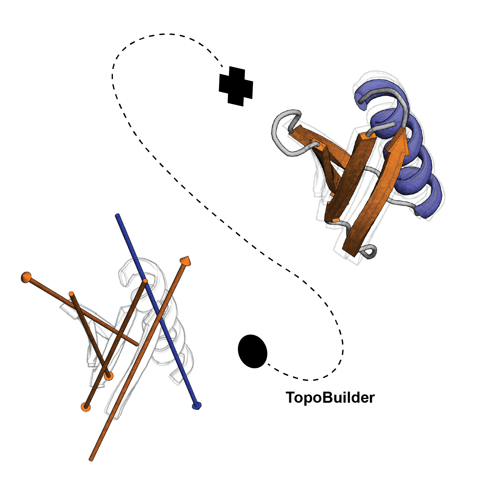

TopoBuilder
===========

The TopoBuilder is a framework for template free de novo protein design and is specifically useful for the construction of protein scaffolds around functional structural motifs of interest. It has been fully re-implemented in a modular, seamless fashion with many new features and utilites that make it easy to modify and customize.

This repository contains the *TopoBuilder framework* as described in:
Zander Harteveld, Jaume Bonet, Stéphane Rosset, Che Yang, Fabian Sesterhenn, and Bruno E. Correia. A generic framework for layered de novo protein design. (2021)

Installation
------------

The easiest way to install the TopoBuilder is via through pip:

.. code-block:: bash

  pip install topobuilder

Requirements
------------

To complete a TopoBuilder pipeline you will need:

* Python (3.7)
* PSIPRED (4.0): Secondary structure prediction from a protein sequence. 
* Rosetta (3.9): Used for fragment assembly and sequence design of the final model.
* MASTER (1.6): Needed for fast protein structure searches for calculating per secondary structure element (SSE) corrections and loop searches.

The statistics plugin contains mutliple options that will require additional dependencies (optional):

* MolProbity: To calculate the MolProbity score.
* trRosetta: To predict a possible model directly from the designed sequence (with all dependencies installed).
* TMalign: To calculate a TMscore between the trRosetta model and the TopoBuilder model.

Code design choices
-------------------

The code lives within the [topobuilder](topobuilder/) directory. We will briefly go through the most important ones:

* core: Initialization and configurations.
* case: Creates and handles the internal case object.
* form: Fabric to create ideal structural SSE assemblies.
* utils: Utility functions shared across multiple plugins.
* base_plugins: Various plugins to do different manipulations on the case object.

Please see the documentation for further explanation of all entry-points, plugins (and how to create your own custom plugin) and utilities available. Additional, we explain how to setup a pipeline and showcase different examples `here <https://github.com/LPDI-EPFL/TopoBuilderData>`_.
